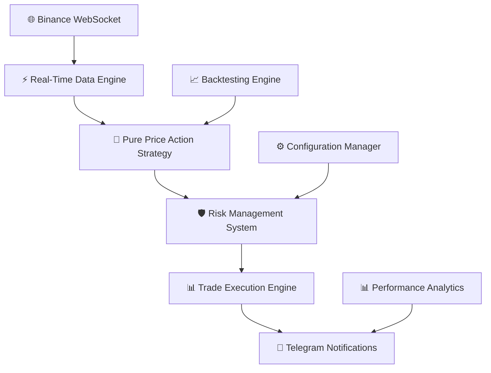

<div align="center">

# 🤖 Advanced Cryptocurrency Trading Bot


**🚀 Professional-Grade Algorithmic Trading System**

_Built with precision engineering for the modern crypto trader_

---

**👨‍💻 Author:** [Minhajul Islam](https://github.com/minhajulislamme)  
**🌟 GitHub:** [https://github.com/minhajulislamme](https://github.com/minhajulislamme)

</div>

<div align="center">
  <h3>🎯 Pure Price Action • 🔄 Real-Time Processing • 🛡️ Advanced Risk Management</h3>
</div>

---

## 💫 **What Makes This Special?**

A next-generation cryptocurrency trading bot engineered for **Binance Futures** with cutting-edge pure price action strategies, lightning-fast WebSocket data processing, military-grade risk management, and fully automated trading capabilities that work 24/7.

## ✨ **Core Features**

<table>
<tr>
<td width="50%">

### 🎯 **Pure Price Action Engine**

```
🔍 Zone-Based Analysis
📊 Pattern Recognition
🧮 Mathematical Precision
📈 TradingView Integration
```

_No lagging indicators - pure market structure analysis_

### � **Lightning-Fast Processing**

```
⚡ WebSocket-Only Signals
🔄 60-Candle Rolling Buffer
⏱️ Multi-Timeframe Support
🚫 Deduplication Engine
```

_Millisecond-precision trade execution_

</td>
<td width="50%">

### 🛡️ **Military-Grade Risk Management**

```
📏 Dynamic Position Sizing
🎯 Advanced Stop Losses
💰 Margin Safety Controls
🔀 Multi-Instance Support
```

_Your capital protection is our priority_

### 📱 **Smart Automation**

```
💬 Telegram Integration
📊 Auto Chart Generation
📈 Performance Reports
🔍 Health Monitoring
```

_Stay informed without being glued to screens_

</td>
</tr>
</table>

---

<div align="center">

## 🏗️ **System Architecture**



</div>

## � **Project Blueprint**

<div align="center">

```
🏗️ hft-system/
├── 🚀 main.py                          # Core trading engine
├── 📋 requirements.txt                 # Dependencies manifest
├── 📊 pure_price_action_by_minhaz.pine # TradingView strategy
├── 🔧 modules/
│   ├── 🌐 binance_client.py           # Exchange connectivity
│   ├── ⚙️ config.py                   # System configuration
│   ├── 🎯 strategies.py               # Trading algorithms
│   ├── 🛡️ risk_manager.py             # Risk controls
│   ├── 📈 backtest.py                 # Performance testing
│   └── ⚡ websocket_handler.py        # Real-time data pipeline
├── 🎬 run_bot.sh                       # Launch script
├── 🛠️ setup.sh                        # Auto-installer
├── 🔍 check_bot_status.sh             # Health monitor
├── ⏹️ stop_bot_manual.sh              # Safe shutdown
└── ⏰ setup_cron.sh                   # Automation scheduler
```

</div>

---

<div align="center">

## 🚀 **Quick Start Guide**

_Get up and running in under 5 minutes_

</div>

### 🎯 **Step 1: Clone & Setup**

```bash
# 📥 Clone the repository
git clone https://github.com/minhajulislamme/hft-system.git
cd hft-system

# 🚀 One-command setup (handles everything!)
chmod +x setup.sh && ./setup.sh
```

<div align="center">

<em>The setup script handles virtual environment, dependencies, and system service configuration</em>
</div>

### 🔐 **Step 2: Configure Your Credentials**

Create your `.env` file with these settings:

```env
# 🔑 Binance API Setup
BINANCE_API_KEY=your_api_key_here
BINANCE_API_SECRET=your_api_secret_here
BINANCE_API_TESTNET=false                # ⚠️ Use true for testing!

# 💹 Trading Configuration
TRADING_SYMBOL=SOLUSDT                   # 🎯 Primary trading pair
LEVERAGE=20                              # ⚡ Futures leverage
FIXED_TRADE_PERCENTAGE=0.20              # 💰 20% per trade
MAX_OPEN_POSITIONS=3                     # 🔢 Concurrent positions

# 📱 Telegram Alerts (Optional but recommended)
USE_TELEGRAM=true
TELEGRAM_BOT_TOKEN=your_bot_token
TELEGRAM_CHAT_ID=your_chat_id

# 🛡️ Advanced Risk Controls
MARGIN_SAFETY_FACTOR=0.90               # 90% margin utilization
MAX_POSITION_SIZE_PCT=0.50              # 50% max position size
USE_STOP_LOSS=true
STOP_LOSS_PCT=0.02                      # 2% stop loss
TRAILING_STOP=true                      # ✅ Enable trailing stops
```

### 🧪 **Step 3: Validate Your Setup**

```bash
# 🔍 Run a comprehensive backtest
python3 main.py --backtest \
  --symbol SOLUSDT \
  --strategy PurePriceActionStrategy \
  --start-date "30 days ago"
```

<div align="center">

</div>

---

<div align="center">

## 🎮 **Command Center**

_Master your trading bot with these powerful commands_

</div>

<table>
<tr>
<td width="50%">

### 🟢 **Live Trading Commands**

```bash
# 🚀 Launch trading bot
./run_bot.sh

# 🎯 Trade specific symbol
python3 main.py --small-account \
  --skip-validation --symbol SOLUSDT

# 📊 Multi-symbol trading
python3 main.py --symbol BTCUSDT \
  --strategy PurePriceActionStrategy \
  --timeframe 5m
```

### 📊 **Backtesting Arsenal**

```bash
# 🔍 30-day backtest
python3 main.py --backtest \
  --symbol ADAUSDT \
  --strategy PurePriceActionStrategy \
  --start-date "30 days ago"

# 📈 Extended analysis (90 days)
python3 main.py --backtest \
  --symbol BTCUSDT \
  --strategy PurePriceActionStrategy \
  --start-date "90 days ago"
```

</td>
<td width="50%">

### 🔍 **Monitoring & Control**

```bash
# 📊 Check bot status
./check_bot_status.sh

# ⏹️ Safe shutdown
./stop_bot_manual.sh

# 📝 View live logs
journalctl -u binancebot -f

# 🔄 Restart service
sudo systemctl restart binancebot
```

### 🧪 **Testing & Development**

```bash
# 📝 Paper trading mode
python3 main.py --test-trade \
  --symbol ADAUSDT \
  --strategy PurePriceActionStrategy \
  --small-account

# ⚡ Quick performance check
python3 main.py --report
```

</td>
</tr>
</table>

---

<div align="center">

## 🧠 **The Strategy Engine**

_Pure Price Action Algorithm - No Indicators, Pure Market Structure_

</div>

<table>
<tr>
<td width="25%" align="center">
<h3>🎯 Zone Detection</h3>
<code>S/R Level Analysis</code><br>
<code>Zone Strength ≥3/10</code><br>
<code>Dynamic Boundaries</code>
</td>
<td width="25%" align="center">
<h3>📊 Pattern Recognition</h3>
<code>Pin Bar Analysis</code><br>
<code>Engulfing Patterns</code><br>
<code>Breakout Confirmation</code>
</td>
<td width="25%" align="center">
<h3>🔢 Signal Scoring</h3>
<code>Multi-Factor Analysis</code><br>
<code>Min 4/10 Strength</code><br>
<code>Real-Time Validation</code>
</td>
<td width="25%" align="center">
<h3>🛡️ Risk-First Design</h3>
<code>Stop-Loss Sizing</code><br>
<code>Volatility Adjustment</code><br>
<code>Dynamic Multipliers</code>
</td>
</tr>
</table>

### 🎯 **Strategy Deep Dive**

<details>
<summary><strong>🔍 Click to expand strategy details</strong></summary>

#### **Phase 1: Zone Identification** 🎯

- Scans historical price data for high-probability support/resistance zones
- Calculates zone strength using multiple factors (touches, time, rejections)
- Only considers zones with strength ≥ 3/10 for trading signals

#### **Phase 2: Pattern Recognition** 📊

- **Pin Bars:** Hammer and shooting star formations
- **Engulfing Patterns:** Strong momentum continuation signals
- **Zone Rejections:** Clean bounces from S/R levels
- **Breakout Confirmations:** Volume-backed level breaks

#### **Phase 3: Signal Generation** ⚡

- Multi-factor scoring system (momentum + volatility + zone strength)
- Minimum 4/10 signal strength required for execution
- Real-time confirmation using WebSocket data only

#### **Phase 4: Risk Management** 🛡️

- Position sizing based on stop-loss distance and account volatility
- Dynamic risk adjustment based on market conditions
- Trailing stops that only move in profitable direction

</details>

---

<div align="center">

## 📈 **Performance Dashboard**

_Real-time analytics and comprehensive reporting_

</div>

<table>
<tr>
<td width="50%">

### 🎯 **Live Metrics**

```
📊 Win Rate Tracking
💰 Real-Time P&L
📉 Drawdown Protection
🔄 Auto-Compounding
```

### 📈 **Smart Analytics**

```
📅 Daily Summaries
🔍 Trade Breakdowns
🌐 Connection Health
⚖️ Risk Utilization
```

</td>
<td width="50%">

### 📊 **Performance Visualization**

```
    📈 Equity Curve
    ┌─────────────────┐
    │ ╭─╮     ╭─╮     │
    │╭╯ ╰─╮ ╭─╯ ╰─╮   │
    ││    ╰─╯    ╰─╮ │
    │╰─────────────╯ │
    └─────────────────┘

    🎯 Win Rate: 68.5%
    💰 Total P&L: +15.7%
    📉 Max DD: -3.2%
```

</td>
</tr>
</table>

---

<div align="center">

## ⚙️ **Configuration Hub**

_Fine-tune every aspect of your trading system_

</div>

### 🎛️ **Trading Parameters**

<table>
<tr>
<td width="33%">

**🎯 Core Settings**

```python
TRADING_SYMBOL = 'SOLUSDT'
LEVERAGE = 20
FIXED_TRADE_PERCENTAGE = 0.20
MAX_OPEN_POSITIONS = 3
```

</td>
<td width="33%">

**🛡️ Risk Controls**

```python
MARGIN_SAFETY_FACTOR = 0.90
MAX_POSITION_SIZE_PCT = 0.50
STOP_LOSS_PCT = 0.02
TRAILING_STOP = True
```

</td>
<td width="33%">

**📊 Strategy Tuning**

```python
PRICE_ACTION_LOOKBACK = 20
BREAKOUT_THRESHOLD = 0.02
VOLATILITY_WINDOW = 14
MOMENTUM_WINDOW = 10
```

</td>
</tr>
</table>

---

<div align="center">

## 🏗️ **System Architecture**

_Enterprise-grade infrastructure for 24/7 operation_

</div>

### 🔄 **Continuous Operation**

<table>
<tr>
<td width="50%">

**🛠️ Infrastructure**

- ⚙️ **Systemd Service:** Auto-start & restart
- 🔄 **Error Recovery:** Intelligent reconnection
- 💾 **State Persistence:** Crash-resistant memory
- 🛑 **Graceful Shutdown:** Safe position handling

</td>
<td width="50%">

**📊 Monitoring & Control**

```bash
# 🔍 System status
./check_bot_status.sh

# 📝 Live monitoring
journalctl -u binancebot -f

# 🔄 Service management
sudo systemctl restart binancebot

# ⏰ Automated monitoring
./setup_cron.sh
```

</td>
</tr>
</table>

---

<div align="center">

## 🔧 **System Requirements**

_Optimized for modern infrastructure_

</div>

<table>
<tr>
<td width="50%">

### 💻 **Hardware Specs**

```
🖥️ OS: Linux (Ubuntu 18.04+)
🐍 Python: 3.8+
💾 Memory: 2GB+ RAM
💿 Storage: 1GB+ free space
🌐 Network: Stable connection
```

</td>
<td width="50%">

### 📦 **Dependencies Stack**

```
🔗 python-binance==1.0.28
🔢 numpy>=1.20.0,<2.0.0
📊 pandas>=1.3.0,<3.0.0
📈 pandas-ta>=0.3.14b
⚙️ python-dotenv>=0.19.0
⏰ schedule>=1.1.0
🌐 websocket-client>=1.2.1
📡 requests>=2.26.0
📊 matplotlib>=3.5.0
```

</td>
</tr>
</table>

---

<div align="center">

## ⚠️ **Risk Management & Disclaimers**

_Your safety is our priority_

</div>

<div align="center">


</div>

### 🚨 **Critical Risk Factors**

<table>
<tr>
<td width="25%" align="center">
<h4>💸 Capital Risk</h4>
<p>You may lose part or all of your invested capital</p>
</td>
<td width="25%" align="center">
<h4>📈 Market Risk</h4>
<p>Crypto markets are highly volatile and unpredictable</p>
</td>
<td width="25%" align="center">
<h4>🔧 Technical Risk</h4>
<p>Software bugs or connectivity issues may cause losses</p>
</td>
<td width="25%" align="center">
<h4>⚖️ Regulatory Risk</h4>
<p>Trading regulations may change without notice</p>
</td>
</tr>
</table>

### ✅ **Safety Recommendations**

<div align="center">

```
🎯 Start with small amounts
🧪 Use testnet environment first
📚 Understand the strategy completely
📊 Monitor performance regularly
💰 Never risk more than you can afford to lose
```

</div>

---

<div align="center">

## 🤝 **Community & Support**

_Join the trading revolution_

</div>

<div align="center">

[](https://github.com/minhajulislamme)
[](https://github.com/minhajulislamme/hft-system/issues)
[](https://github.com/minhajulislamme/hft-system/pulls)

</div>

### 🔗 **Get Connected**

<table>
<tr>
<td width="33%" align="center">
<h4>🐛 Report Issues</h4>
<p>Found a bug? Open an issue on GitHub</p>
</td>
<td width="33%" align="center">
<h4>🚀 Contribute</h4>
<p>Fork, improve, and submit pull requests</p>
</td>
<td width="33%" align="center">
<h4>📝 Best Practices</h4>
<p>Follow coding standards and documentation</p>
</td>
</tr>
</table>

---

<div align="center">

## 📜 **License & Legal**

_Educational and research purposes_


**This project is provided as-is for educational and research purposes.**  
_Users are responsible for compliance with local regulations and exchange terms of service._

</div>

---

<div align="center">

### 💝 **Built with Passion**

**🔥 Crafted by [Minhajul Islam](https://github.com/minhajulislamme)**


_"In trading, the goal is not to be right all the time, but to make money when right and lose less when wrong."_

**⭐ Star this repo if it helped you become a better trader!**

</div>

---

<div align="center">
<sub>🤖 Advanced Cryptocurrency Trading Bot - Engineered for Excellence</sub>
</div>
